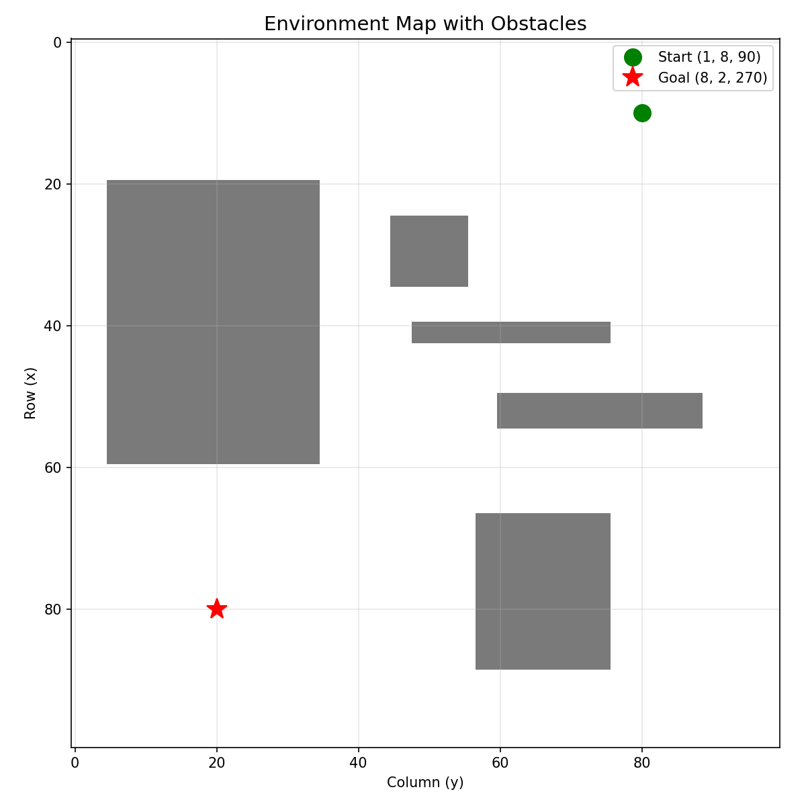
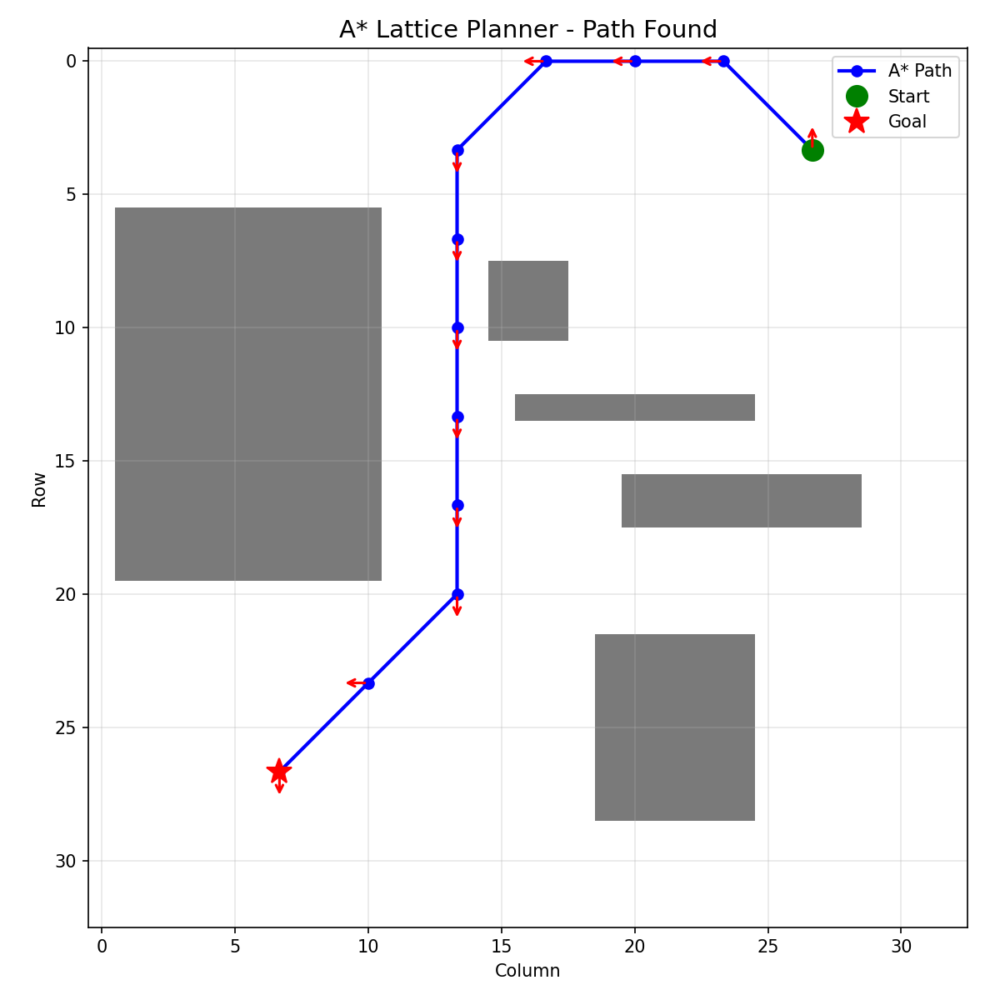
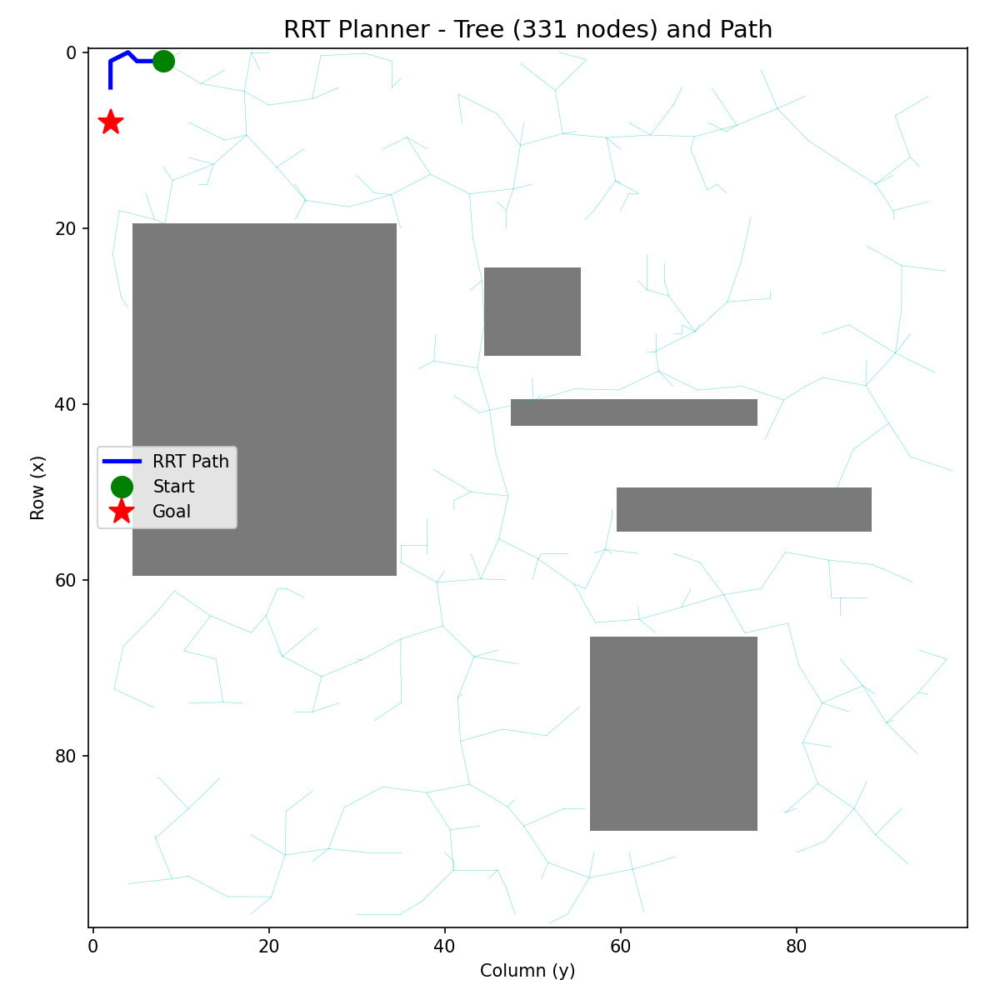
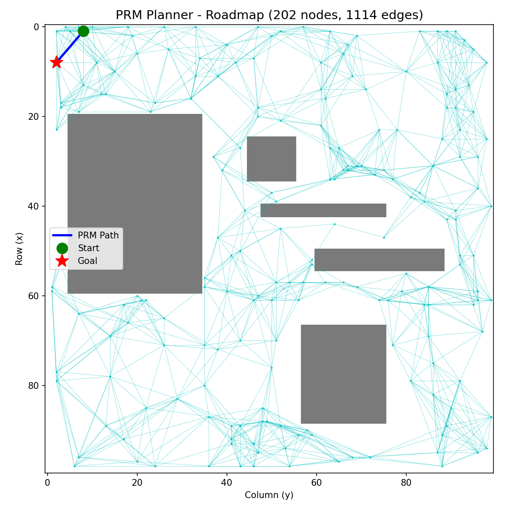
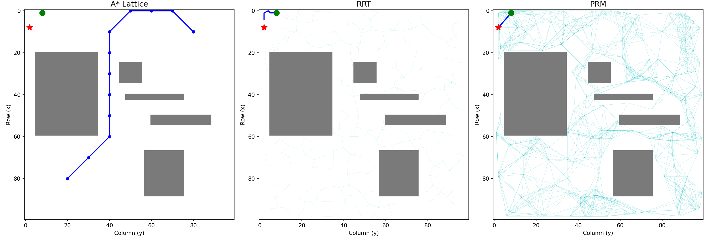
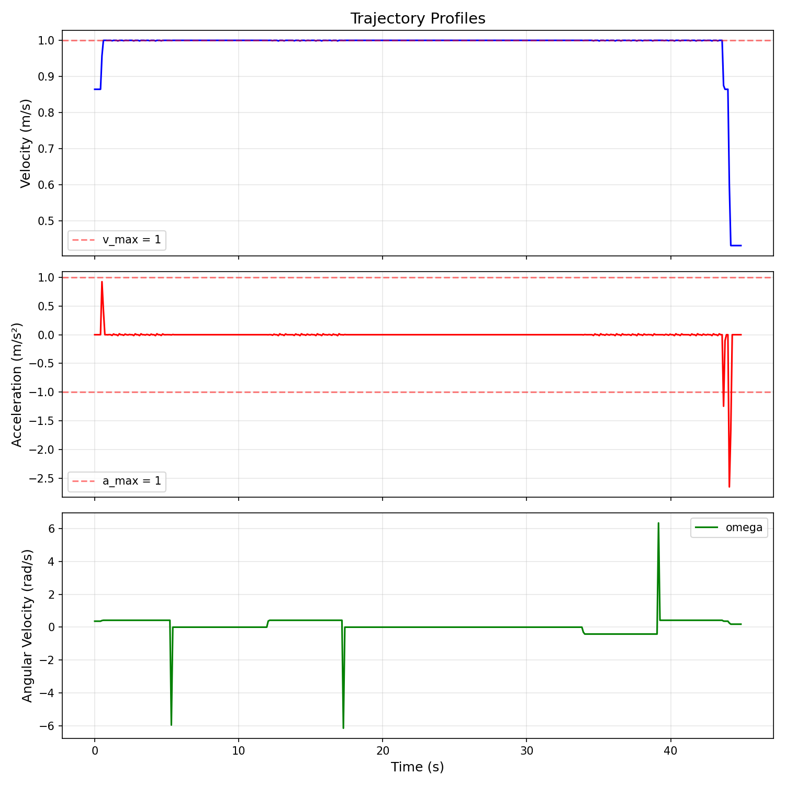
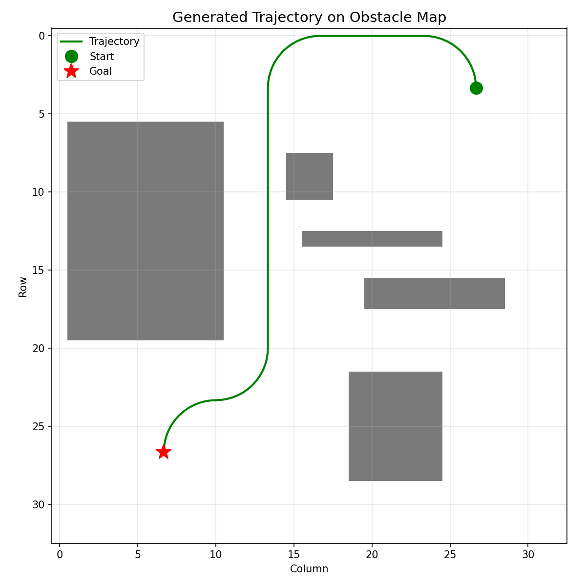
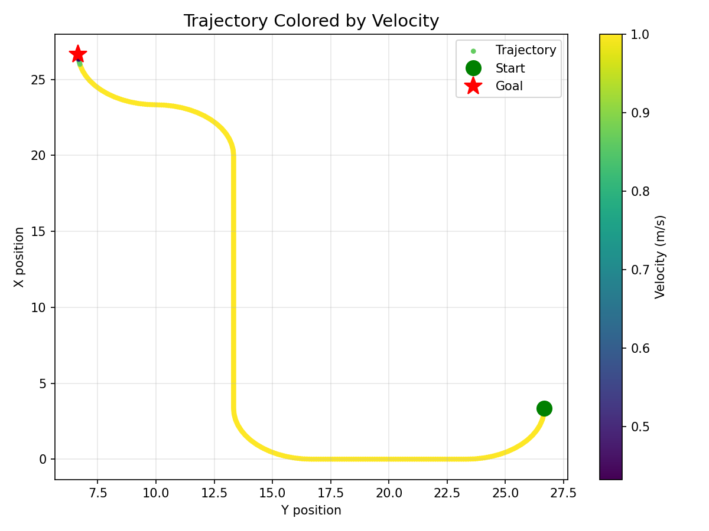
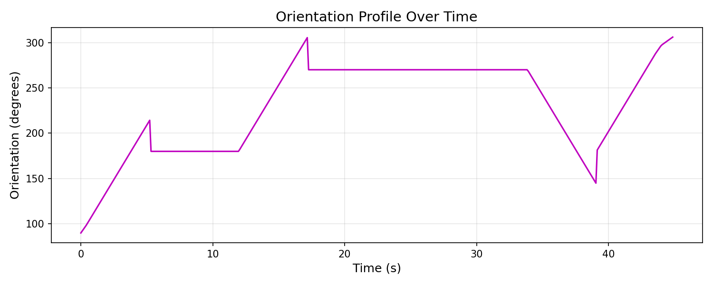

\newpage

# 1. PROJECT OVERVIEW

The project implements **3 path planning algorithms** and a **trajectory generator** for a mobile robot in an environment with obstacles.

## File Architecture

```
main.py                          -- Orchestrator: builds map, runs planners, plots
path_planner/
  utils.py                       -- Graph data structure + ObstaclesGrid (collision checker)
  lattice_planner.py             -- Lattice graph + A*
  rrt_planner.py                 -- Rapidly-exploring Random Tree
  prm_planner.py                 -- Probabilistic Roadmap
trajectory_generator/
  traj_generation.py             -- Resampling, velocity profiling, interpolation
```

## Complete Data Flow (main.py)

1. Create 10x10 lattice grid (= 400 vertices with 4 orientations)
2. Define obstacles on a 100x100 boolean map
3. Invalidate edges crossing obstacles (weight = inf)
4. A\* finds the optimal path on the lattice
5. RRT finds a path in continuous space
6. PRM builds a roadmap and searches for a path
7. Interpolate the lattice path (densify)
8. Generate trajectory with trapezoidal velocity profile
9. Visualize results

## The Obstacle Map

{ width=65% }

**Code that defines it** (`main.py` lines 37-48):

```python
obs.map[25:35, 45:56] = True      # upper-center block
obs.map[40:43, 48:76] = True      # horizontal bar
obs.map[67:89, 57:76] = True      # lower-right block
obs.map[50:55, 60:89] = True      # lower bar
obs.map[20:60, 5:35] = True       # large left block
```

- **Start**: `(1, 8, 90)` -- row 1, column 8, facing "up" (90 degrees)
- **Goal**: `(8, 2, 270)` -- row 8, column 2, facing "down" (270 degrees)

## Key Lattice Concepts

- **Lattice vertex**: a tuple `(row, col, angle)`. Row and col are the position on the grid, angle is the robot's orientation (0, 90, 180, or 270 degrees).
- **Straight edges**: weight = 1 (one cell length).
- **Arc edges**: weight = pi (quarter circle).
- **Obstacles**: 100x100 boolean numpy array. An edge is invalid if any sampled point along it falls inside an obstacle cell.

\newpage

# 2. A\* ALGORITHM ON LATTICE

**File**: `lattice_planner.py`

## 2.1 Lattice Graph Structure

Each cell of the 10x10 grid has 4 possible orientations = **400 total vertices**.

**Straight edges** (weight = 1): The robot advances one cell in its heading direction.

- Angle 0 $\rightarrow$ moves right (col+1)
- Angle 90 $\rightarrow$ moves up (row-1)
- Angle 180 $\rightarrow$ moves left (col-1)
- Angle 270 $\rightarrow$ moves down (row+1)

**Arc/curve edges** (weight = $\pi$): The robot turns 90 degrees while advancing to a diagonal cell.

**Generation code** (`lattice_planner.py` lines 66-183):

```python
# Vertices: 4 angles per cell (lines 75-79)
for row in range(n_rows):
    for col in range(n_cols):
        for angle in [0, 90, 180, 270]:
            v = (row, col, angle)
            self._graph.add_vertex(v)

# Straight edge - move down (lines 101-103)
if (row + 1) < n_rows and angle == 270:
    v_buttom = (row + 1, col, 270)
    self._graph.set_edge(v, v_buttom, 1)          # weight = 1

# Arc edge - diagonal turn (lines 105-107)
if (col - 1) >= 0 and (row + 1) < n_rows and angle == 270:
    v_buttom_left = (row + 1, col - 1, 180)
    self._graph.set_edge(v, v_buttom_left, np.pi)  # weight = pi
```

\begin{questionbox}
"Why is the arc weight pi and not sqrt(2)?"
\end{questionbox}
\begin{answerbox}
The arc is a quarter circle with radius = 1 cell. Its length is $(2\pi r)/4 = \pi r/2$. With the normalized radius, the code uses $\pi$ as an approximation of the cost of traversing that curve. It is greater than a straight line (1) because the curve is longer.
\end{answerbox}

## 2.2 Obstacle Invalidation

`update_obstacles()` (`lattice_planner.py` lines 34-47):

```python
def update_obstacles(self, obs):
    for edge_key, edge_val in self._graph._edge_dict.items():
        is_valid = obs.is_edge_valid(edge_key, edge_val,
                        self.lattice_cell_size, self.arc_primitives)
        if not is_valid:
            self._graph._edge_dict[edge_key] = np.inf  # blocked edge
    self._graph.set_adjacency_matrix()
```

Each edge (straight line or arc) is sampled and if **any point** falls inside an obstacle, the weight is set to `inf`. A\* will never select that edge.

\newpage

## 2.3 A\* Implementation

**Lines 209-238** of `lattice_planner.py`

{ width=65% }

```python
distances[s] = 0                    # g(start) = 0
costs[s] = self.calH(s, g)          # f(start) = 0 + h(start)

while not open_set.empty():
    cost, curr = open_set.get()     # pop node with lowest f

    if curr in closed_set:          # lazy deletion: skip duplicates
        continue
    closed_set.add(curr)            # mark as expanded

    if curr == g:                   # goal check AFTER popping
        path = self.traverse_path(s, g, parent_node)
        return path

    neighbors = self.get_neighbor(curr, graph_vert_list, adjacency_matrix)
    for n in neighbors:
        if n in closed_set:
            continue

        g_cost = distances[curr] + self.cal_expand_cost(curr, n, edge_dict)

        if n not in distances or g_cost < distances[n]:
            distances[n] = g_cost
            f = g_cost + self.calH(n, g)     # f = g + h
            costs[n] = f
            parent_node[n] = curr
            open_set.put((f, n))             # push with f-cost priority

print("no path found")
return None
```

### Key Concepts Table

| Concept | What it is | In your code |
|---------|-----------|-------------|
| g-cost | Actual cost from start to node | `distances[n]` |
| h-cost | Estimate from node to goal | `calH(n, g)` |
| f-cost | g + h, estimated total cost | `f = g_cost + self.calH(n, g)` |
| Open set | Discovered but unexpanded nodes | `PriorityQueue` (min-heap) |
| Closed set | Already expanded nodes | `set()` |
| Lazy deletion | Push duplicates, skip on pop | `if curr in closed_set: continue` |

\begin{questionbox}
"Why do you check the goal AFTER popping it from the queue and not when you add it?"
\end{questionbox}
\begin{answerbox}
If I check when adding, I might find the goal via a suboptimal path first. By checking after popping, the PriorityQueue guarantees that the first time I pop the goal, its f-cost is the minimum. With an admissible heuristic, this guarantees optimality.
\end{answerbox}

\begin{questionbox}
"What is lazy deletion and why do you use it?"
\end{questionbox}
\begin{answerbox}
Python's PriorityQueue does not have a \texttt{decrease-key} operation. When I find a better path to a node, I cannot update its priority in the queue. Instead, I push a new entry with the new priority. When I pop a stale entry (the node is already in the closed\_set), I simply skip it. This is correct and O(E log V) in practice.
\end{answerbox}

## 2.4 Path Reconstruction

**Lines 255-262** of `lattice_planner.py`:

```python
path = []
curr = g
while curr != s:
    path.append(curr)
    curr = parent_node[curr]
path.append(s)
path.reverse()
return path
```

Classic backtracking: from goal, follow parent pointers back to start, then reverse.

\begin{questionbox}
"Why not build the path forward from start?"
\end{questionbox}
\begin{answerbox}
During the search, I only record each node's parent (\texttt{parent\_node[child] = parent}), not its children. I can only trace from child to parent, so I go from goal to start and then reverse.
\end{answerbox}

## 2.5 Heuristic: Euclidean Distance

**Lines 307-309** of `lattice_planner.py`:

```python
dx = v1[0] - v2[0]
dy = v1[1] - v2[1]
return np.sqrt(dx**2 + dy**2)
```

**Euclidean distance** between (row, col) of the current node and the goal. Ignores the angle.

\begin{questionbox}
"Is your heuristic admissible? Prove it."
\end{questionbox}
\begin{answerbox}
Yes. Euclidean distance is the straight-line distance between two points, which is always $\leq$ any real path cost (which must traverse edges of weight 1 or $\pi$). It never overestimates, therefore it is admissible.
\end{answerbox}

\begin{questionbox}
"Is it consistent (monotone)?"
\end{questionbox}
\begin{answerbox}
Yes. For any node n and neighbor n': $h(n) \leq cost(n,n') + h(n')$. This holds due to the triangle inequality of Euclidean distance. Consistency implies admissibility, and guarantees that A* does not need to reopen nodes.
\end{answerbox}

\begin{questionbox}
"Why do you ignore the angle in the heuristic?"
\end{questionbox}
\begin{answerbox}
The heuristic only needs to be a lower bound. Including angle differences would make it more informed but also more complex. The Euclidean distance on (row, col) is already admissible and works well.
\end{answerbox}

\begin{questionbox}
"Could you use Manhattan distance as a heuristic?"
\end{questionbox}
\begin{answerbox}
Yes, but it would be less informed than Euclidean because the lattice allows diagonal movement via arcs. Manhattan would overestimate for diagonal paths. Euclidean is tighter (closer to the real cost).
\end{answerbox}

## 2.6 Expansion Cost

**Line 291** of `lattice_planner.py`:

```python
return edge_dict[(v1, v2)]
```

Simply looks up the edge weight in the dictionary. Straight = 1, arcs = $\pi$, blocked = $\infty$.

\newpage

# 3. RRT - Rapidly-exploring Random Tree

**File**: `rrt_planner.py`

**Parameters**: `max_iter=500`, `step_size=5`, 100x100 map

{ width=55% }

## 3.1 Main Algorithm

**Lines 40-59** of `rrt_planner.py`:

```python
def plan(self):
    for i in range(self.max_iter):
        rand_node = self.sample_random_point()         # 1. Random sample
        nearest_node = self.find_nearest_node(rand_node)  # 2. Nearest node
        new_node = self.steer(nearest_node, rand_node)    # 3. Advance

        if new_node and not self.is_colliding(new_node, nearest_node):
            self.tree.append(new_node)                    # 4. Add to tree
            if self.reached_goal(new_node):               # 5. Reached goal?
                return self.construct_path(new_node)

    print("Path not found.")
    return None
```

## 3.2 Random Sampling

**Lines 68-70**:

```python
rx = np.random.randint(0, self.map_size[0])
ry = np.random.randint(0, self.map_size[1])
return Node(rx, ry)
```

Uniform random sampling over the entire map. Uses integers because the obstacle map is a discrete grid.

\begin{questionbox}
"Why not add goal biasing?"
\end{questionbox}
\begin{answerbox}
Goal biasing (sampling the goal 5-10\% of the time) would speed up convergence. I kept it simple because with 500 iterations and step\_size=5 on a 100x100 map, it converges well. It was not required by the assignment.
\end{answerbox}

## 3.3 Nearest Node Search

**Lines 82-89**:

```python
best = None
best_d = float('inf')
for n in self.tree:
    d = np.sqrt((n.x - rand_node.x)**2 + (n.y - rand_node.y)**2)
    if d < best_d:
        best_d = d
        best = n
return best
```

Linear scan O(n). Iterates through all tree nodes.

\begin{questionbox}
"This is O(n). How would you improve it?"
\end{questionbox}
\begin{answerbox}
Using a \textbf{KD-Tree} (like \texttt{scipy.spatial.KDTree}) for O(log n) queries. In fact, in my PRM planner I did use a KDTree. For RRT with max 500 iterations, the linear scan is sufficient.
\end{answerbox}

## 3.4 Steer - Advance Toward Sample

**Lines 102-109**:

```python
dx = rand_node.x - nearest_node.x
dy = rand_node.y - nearest_node.y
d = np.sqrt(dx**2 + dy**2)
if d <= self.step_size:
    return Node(rand_node.x, rand_node.y, nearest_node)
nx = nearest_node.x + dx / d * self.step_size   # unit vector * step_size
ny = nearest_node.y + dy / d * self.step_size
return Node(nx, ny, nearest_node)
```

If the sample is within step\_size, use it directly. Otherwise, advance exactly step\_size units in that direction. `dx/d` and `dy/d` form the unit direction vector.

\begin{questionbox}
"Why limit the step size?"
\end{questionbox}
\begin{answerbox}
Without a limit, the tree could jump over obstacles. The step\_size ensures incremental growth and that the collision check between the two nodes is reliable over short distances. It also controls tree density.
\end{answerbox}

## 3.5 Collision Detection

**Lines 122-132**:

```python
dist = np.sqrt((new_node.x - nearest_node.x)**2 +
               (new_node.y - nearest_node.y)**2)
n_steps = max(int(dist), 1)
for i in range(n_steps + 1):
    t = i / n_steps
    px = int(nearest_node.x + t * (new_node.x - nearest_node.x))
    py = int(nearest_node.y + t * (new_node.y - nearest_node.y))
    if px < 0 or px >= self.map_size[0] or \
       py < 0 or py >= self.map_size[1]:
        return True
    if self.obstacles.map[px, py]:
        return True
return False
```

Samples points along the line segment (~1 point per unit distance). If any point is in an obstacle or outside the map, there is a collision.

\begin{questionbox}
"Could your collision check miss an obstacle?"
\end{questionbox}
\begin{answerbox}
With n\_steps = int(dist) I sample $\sim$1 point per unit. Since obstacles occupy 1x1 grid cells, this is generally sufficient. For a perfect check, I would use Bresenham's line algorithm to enumerate all cells the line passes through. But for step\_size=5, the sampling density is adequate.
\end{answerbox}

## 3.6 Goal Check and Path Reconstruction

**reached\_goal** (lines 144-145):

```python
d = np.sqrt((new_node.x - self.goal.x)**2 +
            (new_node.y - self.goal.y)**2)
return d <= self.step_size
```

Uses step\_size as a proximity threshold. With floating-point arithmetic, reaching the exact point is impossible.

**construct\_path** (lines 157-163):

```python
path = []
node = end_node
while node is not None:        # root has parent = None
    path.append((node.x, node.y))
    node = node.parent
path.reverse()
return path
```

\begin{questionbox}
"Is RRT optimal?"
\end{questionbox}
\begin{answerbox}
\textbf{No.} RRT is \textbf{probabilistically complete} (if a path exists, it will find one given enough iterations), but it does NOT guarantee the shortest path. For optimality you need \textbf{RRT*}, which rewires the tree to reduce costs.
\end{answerbox}

\begin{questionbox}
"What is probabilistic completeness?"
\end{questionbox}
\begin{answerbox}
As the number of iterations approaches infinity, the probability of finding a path (if one exists) approaches 1. It is not deterministic: any single run may fail, but given enough time it will succeed.
\end{answerbox}

\begin{questionbox}
"How does step\_size affect RRT performance?"
\end{questionbox}
\begin{answerbox}
Too small: slow expansion, many iterations needed. Too large: might jump over narrow passages, collision checks become less reliable. step\_size=5 on a 100x100 map is a good balance.
\end{answerbox}

\newpage

# 4. PRM - Probabilistic Roadmap

**File**: `prm_planner.py`

**Parameters**: `num_samples=200`, `k_neighbors=10`, `step_size=5`

{ width=55% }

## Two Phases: Construction + Query

## 4.1 Phase 1: Roadmap Construction

**Lines 49-69** of `prm_planner.py`:

```python
# Add start and goal first
self.roadmap.append(self.start)
self.roadmap.append(self.goal)

# Sample obstacle-free points
for _ in range(self.num_samples):
    p = self.sample_free_point()
    if p is not None:
        self.roadmap.append(p)

# Connect each node to its k nearest neighbors
for node in self.roadmap:
    nearest = self.find_k_nearest(node, self.k_neighbors)
    for nb in nearest:
        if not self.is_colliding(node, nb):
            # Bidirectional edges (undirected graph)
            if node not in self.edges:
                self.edges[node] = []
            if nb not in self.edges:
                self.edges[nb] = []
            if nb not in self.edges[node]:
                self.edges[node].append(nb)
            if node not in self.edges[nb]:
                self.edges[nb].append(node)
```

\begin{questionbox}
"Why add start and goal first?"
\end{questionbox}
\begin{answerbox}
If they are not in the roadmap, no path can be found to/from them. They need to participate in the neighbor-finding and edge-building process.
\end{answerbox}

\begin{questionbox}
"Why check for duplicate edges?"
\end{questionbox}
\begin{answerbox}
Because if node A finds B as a neighbor and adds A$\rightarrow$B, then when processing B, it might find A as a neighbor and try to add B$\rightarrow$A again. The checks prevent duplicate entries in the adjacency lists.
\end{answerbox}

## 4.2 Obstacle-Free Sampling

**Lines 78-83**:

```python
for _ in range(100):    # up to 100 attempts (rejection sampling)
    x = np.random.randint(0, self.map_size[0])
    y = np.random.randint(0, self.map_size[1])
    if not self.obstacles.map[x, y]:
        return Node(x, y)
return None
```

\begin{questionbox}
"Why 100 attempts?"
\end{questionbox}
\begin{answerbox}
With the given obstacle configuration ($\sim$20-30\% of the map is obstacles), the probability of failing to find a free point in 100 tries is astronomically small ($\sim 0.3^{100}$). 100 is a safe upper bound that avoids infinite loops.
\end{answerbox}

## 4.3 K Nearest Neighbors with KD-Tree

**Lines 96-107**:

```python
pts = np.array([[n.x, n.y] for n in self.roadmap])
tree = KDTree(pts)
k_actual = min(k + 1, len(self.roadmap))  # k+1 because node itself is included
_, idxs = tree.query([node.x, node.y], k=k_actual)

result = []
for i in idxs:
    nb = self.roadmap[i]
    if nb.x == node.x and nb.y == node.y:  # exclude the node itself
        continue
    result.append(nb)
return result[:k]
```

\begin{questionbox}
"You rebuild the KDTree on every call. Isn't that inefficient?"
\end{questionbox}
\begin{answerbox}
Yes, O(n log n) per call $\times$ n calls = O($n^2$ log n) total. Ideally I would build the tree once after all samples are collected. With 200 nodes it is negligible.
\end{answerbox}

\begin{questionbox}
"Why KDTree in PRM but linear search in RRT?"
\end{questionbox}
\begin{answerbox}
PRM connects ALL nodes to their k neighbors, calling find\_k\_nearest 200+ times. KDTree makes each query O(log n) instead of O(n). For RRT, find\_nearest is called at most 500 times on a growing tree, and the simpler brute-force approach was sufficient.
\end{answerbox}

## 4.4 Phase 2: Path Search with Dijkstra

**Lines 139-189** of `prm_planner.py`:

```python
from queue import PriorityQueue
dist = {}; prev = {}; visited = set()
pq = PriorityQueue()

sk = (self.start.x, self.start.y)   # tuples as keys
gk = (self.goal.x, self.goal.y)
dist[sk] = 0
pq.put((0, sk))

lookup = {}    # tuple -> node
for n in self.roadmap:
    lookup[(n.x, n.y)] = n

while not pq.empty():
    c, curr = pq.get()
    if curr in visited: continue
    visited.add(curr)

    if curr == gk:          # found the goal
        path = []; k = gk
        while k in prev:
            path.append(k); k = prev[k]
        path.append(sk); path.reverse()
        return path

    node = lookup.get(curr)
    if node is None or node not in self.edges: continue

    for nb in self.edges[node]:
        nbk = (nb.x, nb.y)
        if nbk in visited: continue
        w = np.sqrt((node.x - nb.x)**2 + (node.y - nb.y)**2)
        new_c = dist[curr] + w
        if nbk not in dist or new_c < dist[nbk]:
            dist[nbk] = new_c
            prev[nbk] = curr
            pq.put((new_c, nbk))

print("PRM: no path found")
return None
```

This is **Dijkstra's algorithm** (A\* with h=0). Edge weights are Euclidean distances between connected nodes.

\begin{questionbox}
"Why Dijkstra instead of A*?"
\end{questionbox}
\begin{answerbox}
Both work. Dijkstra is simpler (no heuristic function needed). With only $\sim$200 nodes, the performance difference is negligible.
\end{answerbox}

\begin{questionbox}
"Why use tuples as dictionary keys instead of Node objects?"
\end{questionbox}
\begin{answerbox}
Node objects are not hashable by content (they hash by identity). Two different Node objects at the same coordinates would be different keys. Tuples (x,y) compare by value, which is correct.
\end{answerbox}

\begin{questionbox}
"What if start or goal has no edges?"
\end{questionbox}
\begin{answerbox}
The guard \texttt{if node is None or node not in self.edges: continue} handles this. If start/goal are isolated (no collision-free connections), the queue empties and we return None.
\end{answerbox}

\newpage

# 5. COMPARISON OF THE 3 PLANNERS

{ width=95% }

| Property | A\* Lattice | RRT | PRM |
|----------|-----------|-----|-----|
| Space type | Discrete (lattice) | Continuous | Continuous |
| Optimality | Yes (with admissible h) | No | No (approx.) |
| Completeness | Complete | Prob. complete | Prob. complete |
| Multi-query | Yes (same graph) | No (new tree) | Yes (reusable roadmap) |
| Orientation | Yes (4 headings) | No (x,y only) | No (x,y only) |

\begin{questionbox}
"Which planner is better?"
\end{questionbox}
\begin{answerbox}
It depends on the context: \textbf{A*} when you need optimality and the robot has orientation constraints. \textbf{RRT} for single-query in high-dimensional spaces. \textbf{PRM} when you need to solve many queries in the same environment.
\end{answerbox}

\begin{questionbox}
"What is the difference between PRM and RRT?"
\end{questionbox}
\begin{answerbox}
\textbf{PRM is multi-query}: build the roadmap once, query it for different start/goal pairs. \textbf{RRT is single-query}: builds a new tree for each query. PRM has two phases (construction + query); RRT combines exploration and pathfinding in one phase. PRM is better for repeated queries in static environments; RRT is better for single queries or dynamic environments.
\end{answerbox}

\newpage

# 6. TRAJECTORY GENERATION

**File**: `traj_generation.py`

The trajectory converts a **discrete path** (waypoints) into a **continuous profile** with position, velocity, acceleration and angular velocity parameterized by time.

## 6.1 Path Interpolation

**Lines 164-192** of `traj_generation.py`. Densifies the lattice path:

```python
# Straight segments (same orientation): lines 182-186
if path[i][2] == path[i+1][2]:
    for j in range(lattice_cell_size):
        row = v1[0]*lattice_cell_size + j*dir_row/lattice_cell_size
        col = v1[1]*lattice_cell_size + j*dir_col/lattice_cell_size
        sampled_path.append((row/cell_size, col/cell_size, v1[2]))

# Arcs (different orientation): lines 187-191
else:
    arc = graph.arc_primitives[(v1[2], v2[2])]
    arc = np.array(v1[:2]).reshape((2,1)) * lattice_cell_size + arc
    for j in range(arc.shape[1]):
        sampled_path.append((arc[0,j]/cell_size, arc[1,j]/cell_size, ...))
```

\begin{questionbox}
"What is the purpose of path\_interpolation?"
\end{questionbox}
\begin{answerbox}
The lattice path is coarse (only lattice vertices). path\_interpolation samples many points along each edge (10 points per straight segment, $\sim$15 per arc), creating a smooth, dense path suitable for trajectory generation. Without this, the trajectory would have only a few waypoints.
\end{answerbox}

## 6.2 Stations and Gears

**Lines 30-47**:

```python
for i in range(1, len(path)):
    d = self.distance(path[i], path[i-1])
    stations[i] = stations[i-1] + d       # cumulative distance

    # Determine if moving forward or backward
    d_row = path[i][0] - path[i-1][0]
    d_col = path[i][1] - path[i-1][1]
    avg_th = (path[i-1][2] + path[i][2]) / 2.0
    h_row = -math.sin(math.radians(avg_th))  # heading in grid coords
    h_col = math.cos(math.radians(avg_th))
    dot = d_row * h_row + d_col * h_col       # dot product
    if dot >= 0: gears[i] = 1    # forward
    else:        gears[i] = -1   # reverse
```

- **Station**: cumulative distance along the path from the start.
- **Gear**: dot product between displacement and heading. Positive = forward, negative = reverse.

\begin{questionbox}
"Why use -sin for the row component?"
\end{questionbox}
\begin{answerbox}
In grid coordinates, row increases DOWNWARD (like image coordinates). In standard math, y increases upward. So heading angle 90 degrees (pointing "up" in math) means the row DECREASES. The heading in the row direction is $-\sin(\theta)$.
\end{answerbox}

\begin{questionbox}
"Why average the angles?"
\end{questionbox}
\begin{answerbox}
At the transition between two orientations (e.g., in an arc), the actual heading is somewhere between the two endpoints' angles. Averaging gives a reasonable approximation of the robot's heading along that segment.
\end{answerbox}

## 6.3 Trapezoidal Velocity Profile

{ width=55% }

Uses the kinematic equation: $v_f^2 = v_i^2 + 2 \cdot a \cdot \Delta s$

### Forward Pass - Acceleration (lines 124-131):

```python
fwd = [0.0] * len(stations)
for i in range(1, len(stations)):
    ds = stations[i] - stations[i-1]
    if ds < 1e-9:
        fwd[i] = fwd[i-1]
    else:
        v2 = fwd[i-1]**2 + 2 * max_accel * ds
        fwd[i] = min(math.sqrt(max(v2, 0)), max_velocity)
```

Computes the maximum achievable velocity at each station **if the robot accelerates from rest** (velocity 0 at the start).

### Backward Pass - Deceleration (lines 136-143):

```python
bwd = [0.0] * len(stations)
for i in range(len(stations) - 2, -1, -1):
    ds = stations[i+1] - stations[i]
    if ds < 1e-9:
        bwd[i] = bwd[i+1]
    else:
        v2 = bwd[i+1]**2 + 2 * max_accel * ds
        bwd[i] = min(math.sqrt(max(v2, 0)), max_velocity)
```

Same equation but **backwards from the end** (where it must stop, velocity 0).

### Merge - Final Profile (lines 147-154):

```python
for i in range(len(stations)):
    profile[i] = min(fwd[i], bwd[i])    # minimum of both envelopes
```

This creates the classic trapezoidal profile: accelerate $\rightarrow$ cruise $\rightarrow$ decelerate.

\begin{questionbox}
"Explain the trapezoidal velocity profile."
\end{questionbox}
\begin{answerbox}
The robot starts at rest, accelerates at max\_acceleration until it reaches max\_velocity (or until it needs to start braking), cruises at max\_velocity, and decelerates to stop at the goal. It is \textbf{time-optimal} under constant acceleration constraints. The forward pass computes the "accelerating from rest" envelope, the backward pass computes the "decelerating to rest" envelope, and min() gives the feasible profile.
\end{answerbox}

\begin{questionbox}
"Where does the equation $v_f^2 = v_i^2 + 2as$ come from?"
\end{questionbox}
\begin{answerbox}
From the kinematic equations. Combining $v_f = v_i + at$ and $s = v_i t + \frac{1}{2}at^2$, eliminating time $t$, yields $v_f^2 = v_i^2 + 2as$.
\end{answerbox}

\begin{questionbox}
"What if the path is too short to reach max\_velocity?"
\end{questionbox}
\begin{answerbox}
The forward and backward envelopes intersect before reaching max\_velocity, creating a \textbf{triangular} profile (accelerate then immediately decelerate, no cruise phase). The min() handles this automatically.
\end{answerbox}

\begin{questionbox}
"Why do you compute the time profile from the velocity profile?"
\end{questionbox}
\begin{answerbox}
time = distance / velocity. For each segment: dt = ds / v. The total time at each station is the cumulative sum of these dt values. This converts from the spatial domain (distance along path) to the temporal domain (time), which is needed for uniform time-step interpolation.
\end{answerbox}

## 6.4 Velocity and Angular Velocity

**Lines 86-95**:

```python
for i in range(1, nfe):
    dx = result.states[i].x - result.states[i-1].x
    dy = result.states[i].y - result.states[i-1].y
    result.states[i].v = math.sqrt(dx**2 + dy**2) / dt   # v = |disp| / dt
    dth = result.states[i].theta - result.states[i-1].theta
    result.states[i].omega = dth / dt                      # omega = dtheta/dt
if nfe > 1:
    result.states[0].v = result.states[1].v       # boundary condition
    result.states[0].omega = result.states[1].omega
```

Backward finite differences. The first element is copied from the second (no index -1).

\begin{questionbox}
"Why not use a centered difference?"
\end{questionbox}
\begin{answerbox}
A centered difference \texttt{(x[i+1] - x[i-1]) / (2*dt)} would be more accurate (second-order vs first-order), but it would require special handling at both boundaries. For a first implementation, backward difference is simpler and sufficient.
\end{answerbox}

## 6.5 Acceleration

**Lines 99-102**:

```python
for i in range(1, nfe):
    result.states[i].a = (result.states[i].v - result.states[i-1].v) / dt
if nfe > 1:
    result.states[0].a = result.states[1].a
```

## 6.6 Continuous Angles

**Lines 258-269** - `to_continuous_angle()`:

```python
rads = []
for a in angles:
    rads.append(math.radians(a))     # degrees -> radians
out = [rads[0]]
for i in range(1, len(rads)):
    diff = rads[i] - rads[i-1]
    diff = self.normalize_angle(diff)    # normalize to [-pi, pi]
    out.append(out[-1] + diff)           # accumulate smoothly
return out
```

\begin{questionbox}
"What does to\_continuous\_angle do and why is it necessary?"
\end{questionbox}
\begin{answerbox}
Without it, interpolating between heading 350 degrees and 10 degrees would go through 180, 90, 0 instead of smoothly crossing through 360/0 (+20 degrees). The continuous representation "unwraps" the angles so that interpolation sees a +20 degree change, not a -340 degree change. This prevents the robot from spinning wildly during heading transitions.
\end{answerbox}

\begin{questionbox}
"Why convert from degrees to radians?"
\end{questionbox}
\begin{answerbox}
The lattice path uses degree angles (0, 90, 180, 270) because that is how generate\_lattice defines vertices. But for computing velocities, accelerations, and angular velocities, we need radians (the standard unit for angular calculations in physics/robotics).
\end{answerbox}

## 6.7 Normalize Angle

**Lines 229-233**:

```python
while angle > math.pi:
    angle -= 2 * math.pi
while angle < -math.pi:
    angle += 2 * math.pi
return angle
```

Wraps any angle to the range $[-\pi, \pi]$.

\begin{questionbox}
"Why not use modulo?"
\end{questionbox}
\begin{answerbox}
\texttt{angle \% (2*pi)} gives $[0, 2\pi)$, not $[-\pi, \pi]$. You could use \texttt{((angle + pi) \% (2*pi)) - pi}, but the while-loop approach is clearer and for typical angles (near 0) it executes 0-1 iterations.
\end{answerbox}

\newpage

# 7. VISUALIZATION OF RESULTS

## Trajectory on the Map

{ width=60% }

The trajectory (green line) follows the interpolated A\* path, avoiding all obstacles with smooth curves.

## Trajectory Colored by Velocity

{ width=55% }

Dark colors = low velocity (start/end, curves). Bright/yellow colors = high velocity (straight segments, cruise).

## Orientation Profile

{ width=80% }

Starts at 90 degrees, turns through curves, and ends near 270 degrees (goal heading).

\newpage

# 8. PRE-BUILT CODE YOU SHOULD UNDERSTAND

## Graph Class (`utils.py` lines 6-31)

```python
class Graph:
    _vert_list = []              # List of vertices (row, col, angle)
    _edge_dict = {}              # (v1, v2) -> weight
    _adjacency_matrix            # NxN weight matrix
```

**Important note** (`utils.py` lines 28-31): The adjacency matrix uses a transposed convention: `_adjacency_matrix[j, i] = edge_dict[(u, v)]`.

## ObstaclesGrid (`utils.py` lines 33-89)

- `map`: Boolean numpy array (100x100). True = obstacle.
- `is_edge_valid()`: Samples points along an edge and checks for collisions.
- `is_point_valid()`: Checks that a point is not in an obstacle or outside the map.

## get\_neighbor (`lattice_planner.py` lines 265-275)

```python
def get_neighbor(self, u, graph_vert_list, adjacency_matrix):
    row = graph_vert_list.index(u)
    is_adj = (adjacency_matrix[row, :] < np.inf) & \
             (adjacency_matrix[row, :] > 0)
    adj_list = []
    for i, v in enumerate(graph_vert_list):
        if is_adj[i]:
            adj_list.append(v)
    return adj_list
```

Finds the row of the vertex in the adjacency matrix and returns all vertices with a finite and positive edge.

\newpage

# 9. QUICK-FIRE Q\&A BANK (FLASH CARDS)

| \# | Question | Answer |
|----|----------|--------|
| 1 | What data structure does A\* use? | Priority Queue (min-heap), set, dicts |
| 2 | Difference A\* vs Dijkstra? | A\* uses heuristic h(n). f = g + h |
| 3 | What does "admissible" mean? | h never overestimates the true cost |
| 4 | What does "consistent" mean? | h(n) $\leq$ cost(n,n') + h(n') |
| 5 | How many vertices in your lattice? | 10 x 10 x 4 = 400 |
| 6 | Straight edge weight? | 1 |
| 7 | Arc edge weight? | $\pi$ |
| 8 | How are obstacles blocked? | Edge weight = $\infty$ |
| 9 | Is RRT optimal? | No. Prob. complete, not optimal |
| 10 | What is PRM? | Sample free space, connect, search graph |
| 11 | PRM phases? | Construction + Query |
| 12 | When is PRM > RRT? | Multiple queries, same environment |
| 13 | Trapezoidal profile? | Accelerate $\rightarrow$ cruise $\rightarrow$ decelerate |
| 14 | $v_f^2 = v_i^2 + 2as$ comes from? | Eliminate t from $v=v_0+at$ and $s=v_0 t+\frac{1}{2}at^2$ |
| 15 | Why forward AND backward pass? | min(accelerating, decelerating) = feasible |
| 16 | Angular velocity? | $\omega = d\theta/dt$ |
| 17 | Why degrees to radians? | Physics formulas use radians |
| 18 | normalize\_angle? | Wraps to $[-\pi, \pi]$ |
| 19 | to\_continuous\_angle? | Unwraps to avoid jumps at 0/360 |
| 20 | What is gear? | Forward (1) or reverse (-1), by dot product |
| 21 | What is a station? | Cumulative distance along the path |
| 22 | Lattice cell size? | 10 units |
| 23 | What if no A\* path exists? | Queue empties, returns None |
| 24 | A\* complexity? | O(V log V + E log V) |
| 25 | What is lazy deletion? | Push duplicates, skip stale on pop |
| 26 | Goal check: on push or pop? | On pop (guarantees optimality) |
| 27 | If h is not admissible? | A\* may return suboptimal path |
| 28 | What is probabilistic completeness? | P(find path) $\rightarrow$ 1 as iter $\rightarrow \infty$ |
| 29 | Collision check diff RRT vs PRM? | Same idea, different sampling density |
| 30 | What does adjacency matrix store? | Weights. 0=no edge, +val=weight, $\infty$=blocked |
